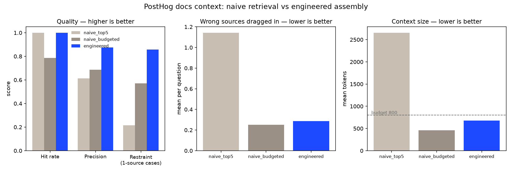

# posthog-context-mcp

An MCP server that serves PostHog's JavaScript/Web SDK docs to a coding agent as
**engineered context** — deduplicated, ordered, token-budgeted, and cited —
plus an eval harness that measures whether that context is actually better than
a naive chunk dump.

It is. Same 100% hit rate as dumping the top 5 chunks, in **74% fewer tokens**,
with precision up from 61% to 88%.



| metric | naive top-5 | naive (budgeted) | **engineered** | better |
|---|---|---|---|---|
| Hit rate | 100% | 79% | **100%** | higher |
| Precision | 61% | 69% | **88%** | higher |
| Restraint (1-source cases) | 21% | 57% | **86%** | higher |
| Wrong sources per question | 1.14 | 0.25 | **0.29** | lower |
| Mean context tokens | 2,655 | 461 | **678** | lower |

*28 hand-labelled questions. `naive top-5` is the top 5 chunks concatenated —
what you get by wiring a retriever straight to a tool. `naive (budgeted)` is the
same ranking truncated at the same 800-token ceiling, included so the engineered
config gets no credit merely for being allowed to stop; it buys its smaller size
by dropping 21% of the answers.*

## Architecture

1. **Ingest** (`posthog_context/ingest.py`) — sparse-clones `PostHog/posthog.com`, resolves the MDX snippet import graph, strips JSX, and chunks by heading into `data/index.json`.
2. **Retrieval** (`retrieval.py`) — BM25 over two fields (heading, body), stemmed, camelCase-aware. No vector DB.
3. **Assembly** (`assemble.py`) — the interesting part: re-score for task fit, cut the long tail, deduplicate, cap sources, budget, order install → API → example, cite every passage.
4. **Server** (`server.py`) — three MCP tools over stdio.
5. **Eval** (`eval/`) — 28 labelled cases, three configs, one command.

## Setup

```bash
python3 -m venv .venv && source .venv/bin/activate && pip install -e .
```

```bash
python -m posthog_context.ingest
```

The ingest clones ~11MB of markdown into `data/` (gitignored) and builds the
index. PostHog's `/contents/` directory is MIT-licensed; the rest of that repo
is not, so we read only `/contents/` and vendor nothing.

## The tools

| tool | use it for |
|---|---|
| `how_do_i(task, token_budget=800)` | **the one that matters.** "How do I capture a custom event in React?" → assembled, cited, budgeted context block. |
| `search_posthog_docs(query, k=5)` | ranked snippets, no assembly. For exploring what exists. |
| `get_posthog_doc(path_or_slug)` | a full page, when the agent genuinely needs all of it. |

## Connect it to an agent

**Claude Desktop** — `~/Library/Application Support/Claude/claude_desktop_config.json`
(on macOS). **Cursor** — `.cursor/mcp.json` in your project. Same shape:

```json
{
  "mcpServers": {
    "posthog-context": {
      "command": "/absolute/path/to/posthog-mcp-mini/.venv/bin/python",
      "args": ["-m", "posthog_context.server"],
      "cwd": "/absolute/path/to/posthog-mcp-mini"
    }
  }
}
```

Absolute paths, and run the ingest first — the server refuses to start without
an index rather than serving an empty one.

## Run the eval

```bash
python -m eval.run
```

Prints the table, names every failing case, and writes
`eval/out/comparison.png`. It asserts that the number of parsed cases equals the
number declared in `cases.yaml` and that every gold label exists in the index,
so a silently-skipped case fails the run instead of quietly shrinking the
experiment.

Each module also self-checks:

```bash
python -m posthog_context.ingest      # 6 assertions on chunk quality
python -m posthog_context.retrieval   # ranking sanity
python -m posthog_context.assemble    # budgets are never exceeded
```

## Scope

The JS/Web SDK and client-side capture: installation, custom events, identify,
person properties, autocapture, configuration. 185 chunks from 15 docs.

Not covered, deliberately: feature flags, session replay, experiments, the
server-side SDKs. Breadth is what makes a docs index vague, and the argument
here is about depth.

## What I'd fix next

See `NOTES.md` for the full decision log. The short version: 28 cases is a small
eval and I tuned constants against it, so a held-out set is the honest next
step; the token counter is a `chars/4` estimate rather than a real tokenizer;
and two restraint failures remain where the assembler finds the right answer and
brings a friend. Ask it "how do I remove a stored super property" and it also
hands you the passage on removing *person* properties — lexically near-identical,
a different API. That specific failure is the real case for adding embeddings.
